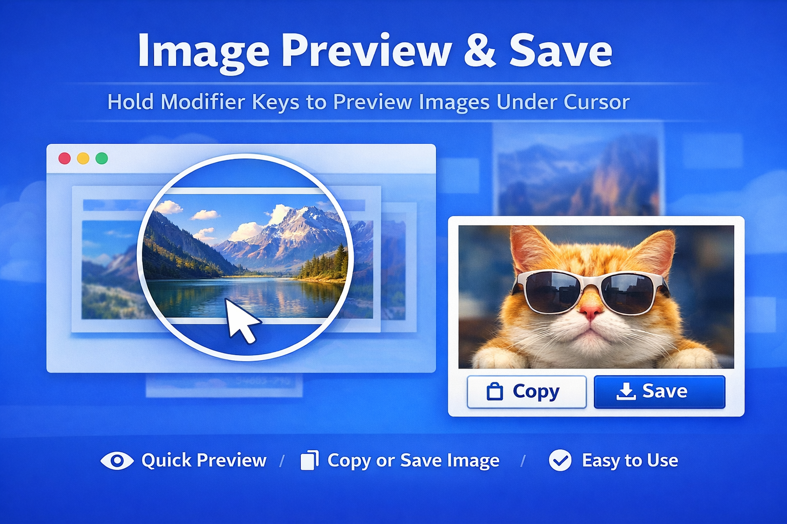
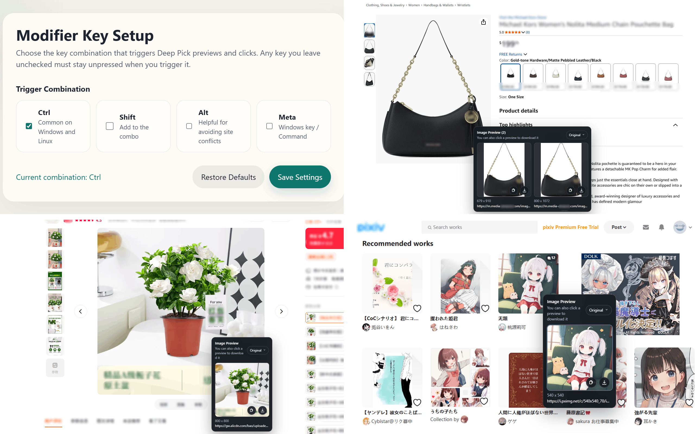

# Deep Pick

A Manifest V3 Chrome extension that lets you preview extractable images under the cursor with a configurable modifier-key shortcut, then click a thumbnail to open the system save dialog. It is intended to work on arbitrary websites (if a site is unsupported or you hit a bug, please [tell me](https://github.com/xiaomingTang/deep-pick/issues)).

## Screenshots

## Current Capabilities

- Supports any combination of Ctrl, Shift, Alt, and Meta for triggering previews and clicks.
- By default, moving the mouse while holding Ctrl+Shift shows a live preview of image candidates near the cursor.
- By default, pressing Ctrl+Shift+Click pins the preview at the current cursor position, whether there is one image or several.
- The preview supports a multi-image grid with 200x200 thumbnails and up to three columns.
- Pinned previews let you switch download format in the upper-right corner: Original, jpg, or png. jpg/png conversion uses a quality setting of 94.
- Each preview image can be copied to the clipboard or downloaded.
- The preview UI shows the image source, dimensions, and URL.
- Images can be extracted from these sources:
  - img / picture img
  - SVG image
  - CSS background-image
  - data-src, data-img, data-image, data-picture, data-pic
- The content script runs in every iframe, and each frame handles hit detection and previews independently.
- Clicking a thumbnail uses the downloads API to open the save dialog and attempts to set a referer with declarativeNetRequest for hotlink-protected sites.

## Installation

1. Open Chrome's Extensions page.
2. Turn on Developer mode.
3. Click Load unpacked.
4. Select this directory.

## Usage

- Click the extension icon to configure the modifier-key shortcut in the popup.
- Hold the configured modifier keys and move the mouse to see a live preview.
- Press the configured modifier keys and click to pin the preview at the current point.
- Click a thumbnail in the preview to open the save dialog.
- Click the copy button to place the corresponding image on the system clipboard.
- Press Esc to close the current pinned preview.

## Notes

- The first version focuses on image extraction only. It does not include color picking or canvas support.
- Some heavily protected sites may still block downloads. The current implementation covers common referer-validation cases, but it does not guarantee compatibility with every site.